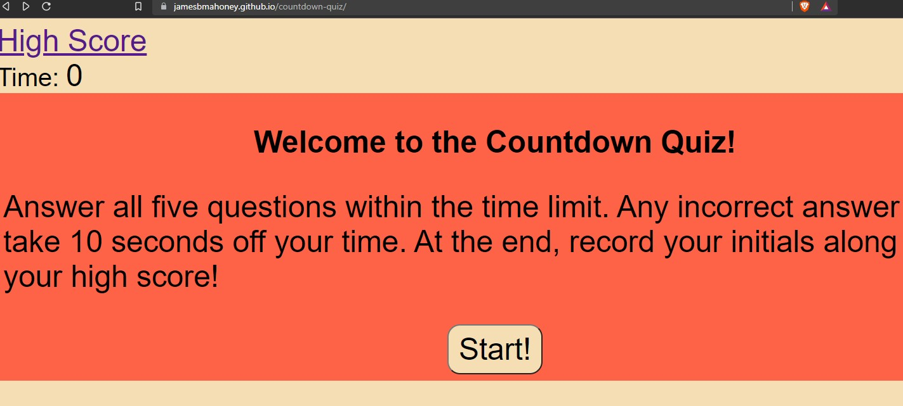
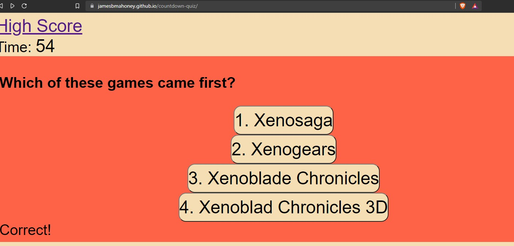
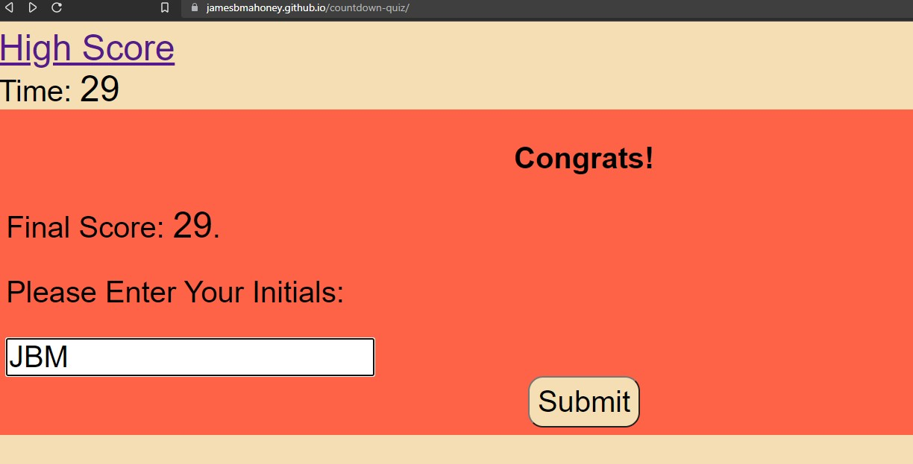

# countdown-quiz

## Purpose

A quiz built in HTML that operated with both a countdown and an ability to save high scores into the localStorage.  As you run through the quiz, different elements are either hidden or shown dynamically using JS.  As you progress through the quiz, time is taken off the timer for every wrong answer and the game ends when you either run out of time or complete the quiz.

## Built With
*HTML
*CSS
*JS

## Image

## Deployed Website
https://jamesbmahoney.github.io/countdown-quiz/highscores.html